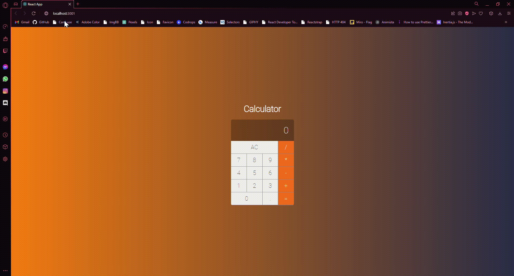

# React Calculator

Calculator designed to perform common mathematical operations



## Running Localy

In the project directory, you can:

### Clone the project

```bash
  git clone https://github.com/Fleemings/React-Calculator.git
```

### Go into the project directory

```bash
  cd calculator/
```

### `npm start`

Open [http://localhost:3000](http://localhost:3000) to view it in your browser.

### Repository

This is a free source, thank you 👋
